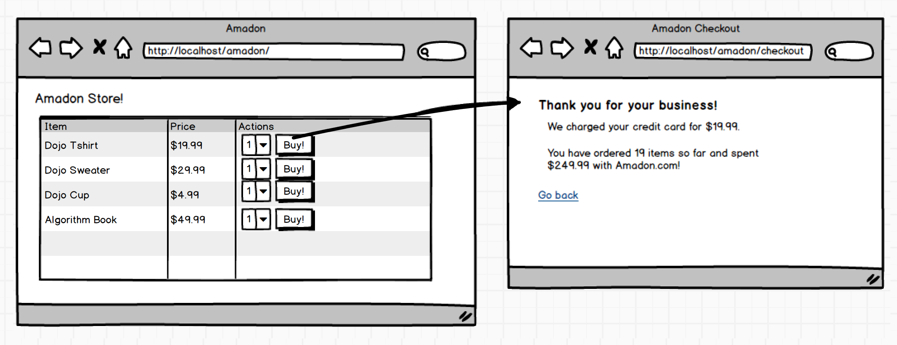
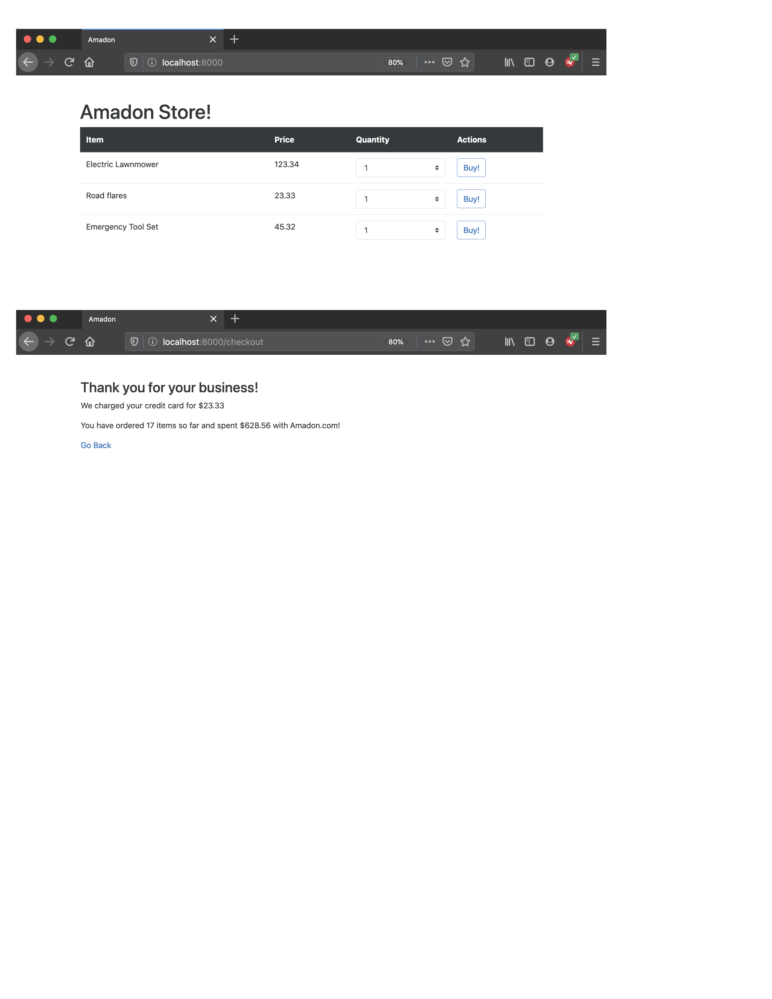

## Assignment: Amadon

### Objectives:

- Practice handling POST data
- Avoid rendering after a POST request
- Be careful about what you put inside <form>tags

We've decided to start building our own e-commerce site called Amadon.

The goal of this assignment is not to build a full-fledged e-commerce site (i.e. no login, validation, etc.). Rather, we want to point out some important things to consider when building forms:

What we should put in our forms versus what should be handled by the server in the backend

- [x] Clone the repository and peruse the code
- [x] Run makemigrations and migrate to create the necessary database tables
- [x] Seed the database with a few products (i.e. go into the shell and create 3-4 products)
- [x] Run the server and make a purchase
- [x] Add some basic styling (use Bootstrap or another CSS framework)
- [x] On the checkout page, calculate and display the total charge for the most recent order
- [x] On the checkout page, calculate and display the total quantity of all orders combined
- [x] On the checkout page, calculate and display the total amount charged for all orders combined
- [x] After making an order, hit the refresh button while on the checkout page and say yes/confirm. What do you notice?
- [x] Fix this issue so that users don't inadvertently make another order by mistake
- [x] Go back to the order form and use your browser's inspect element tool. Change the price of an item and then place an order. What do you notice?
- [x] Fix this issue so that users don't get to set the price of their items!

### My finished project:

