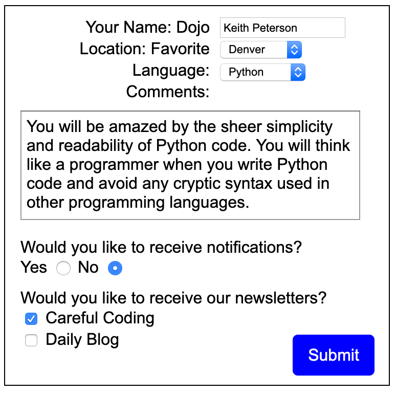
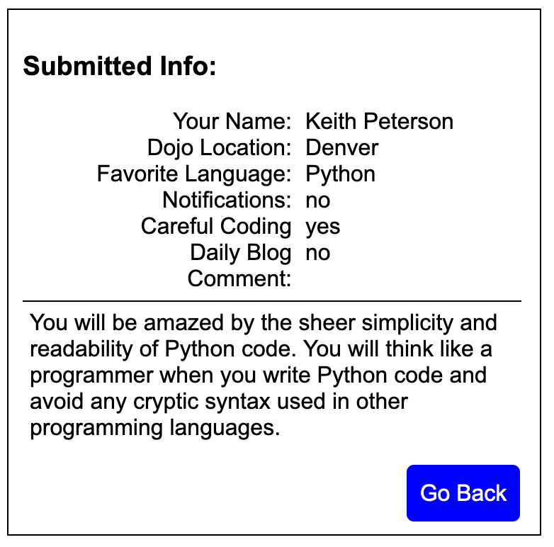

## Assignment: Dojo Survey

### Objectives:

- Practice creating a server with Django from scratch
- Practice adding routes to a Django app
- Practice having the client send data to the server with a form
- Practice having the server render a template using data provided by the client
- Build a new Django application that accepts a form submission and presents the submitted data on a results page.

The goal is to help you get familiar with sending POST requests through a form and displaying that information. Consider the below example as a guide.

When you build this, please make sure that your program meets the following criteria:

http://localhost:8000 - have this display a nice looking HTML form. The form should be submitted to '/result'
http://localhost:8000/result - have this display a html template with the information that was submitted by POST

**Don't forget that any inputs we want to be able to access from the form submission need to have a name!**

It's always a good idea to print request.POST to see if the form is delivering all the information you need in your routing method.

- [x] Create a new Django application
- [x] Have the root route ("/") show a page with the form
- [x] Have the "/result" route display the information from the form on a new HTML page
- [x] NINJA BONUS: Use a CSS framework to style your form
- [x] NINJA BONUS: Include a set of radio buttons on your form
- [x] SENSEI BONUS: Include a set of checkboxes on your form

Dojo Survey Revisited items:

- [x] Alter function that handles form data to return a redirect
- [x] Store form data in request.session
- [x] Redirect to view that shows new user's information

## Assignment: Random Word Generator

The **Random Word** assignment had us add a second app, named random_word to the Dojo_Survey Project.

Add an app to your previous project called 'random_word'. This app will render a template with a random 14-character "word" that also display a counter for the number of words generated. The first time you use this app, it should say 'attempt #1'. Each time you generate a new random keyword, it should increment the attempt figure. The purpose of this assignment is to reinforce your use of session

- [x] Create a new app
- [x] Have the /random_word route display a random string and counter
- [x] When the generate button is clicked or the page is refreshed, display a new random string and increment the counter by 1
- [x] Add a reset route that resets the counter

### My finished survey form screens

### My finished RANDOM WORD screen.

