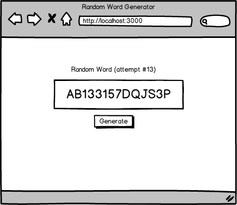
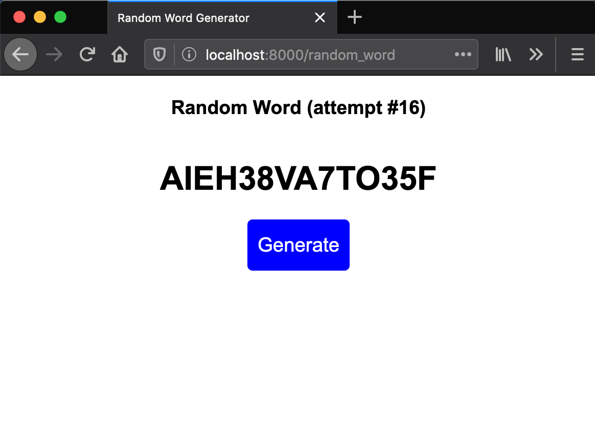

## Assignment: Random Word Generator

### Objectives:

- Practice setting up a Django project
- Practice passing data to a template
- Practice using Django session

If you don't feel comfortable with multiple apps yet, start a new project with a single app for this assignment. Otherwise, add an app to your previous project called 'random_word'. This app will render a template with a random 14-character "word" that also display a counter for the number of words generated. The first time you use this app, it should say 'attempt #1'. Each time you generate a new random keyword, it should increment the attempt figure. The purpose of this assignment is to reinforce your use of session. Don't spend too much time on the random word generator portion--it's okay if your random word is not a real word.

Add functionality so that a request to localhost:8000/random_word/reset resets the counter and redirects back to localhost:8000/random_word.

**Helpful Hints:**

For generating a random word, check out this StackOverflow question, which shows us we can:

- import get_random_string from django.utils.crypto (remember that you can import other libraries/modules in your views.py or any other python files)
- use get_random_string(length=14) to get a random string of length 14

As the goal of this assignment is to really help you get familiar with creating a new app, setting up routing, views, templates, etc, we've given you some hints. :)

- [x] Create a new app
- [x] Have the /random_word route display a random string and counter
- [x] When the generate button is clicked or the page is refreshed, display a new random string and increment the counter by 1
- [x] Add a reset route that resets the counter

**See the Dojo Survey assignment to see how I added Random Word as a second app in that project.**
https://github.com/keithpe/CodingDojo/tree/master/python_stack/django/django_intro/project_dojo_survey

### My finished Random Word Screen

