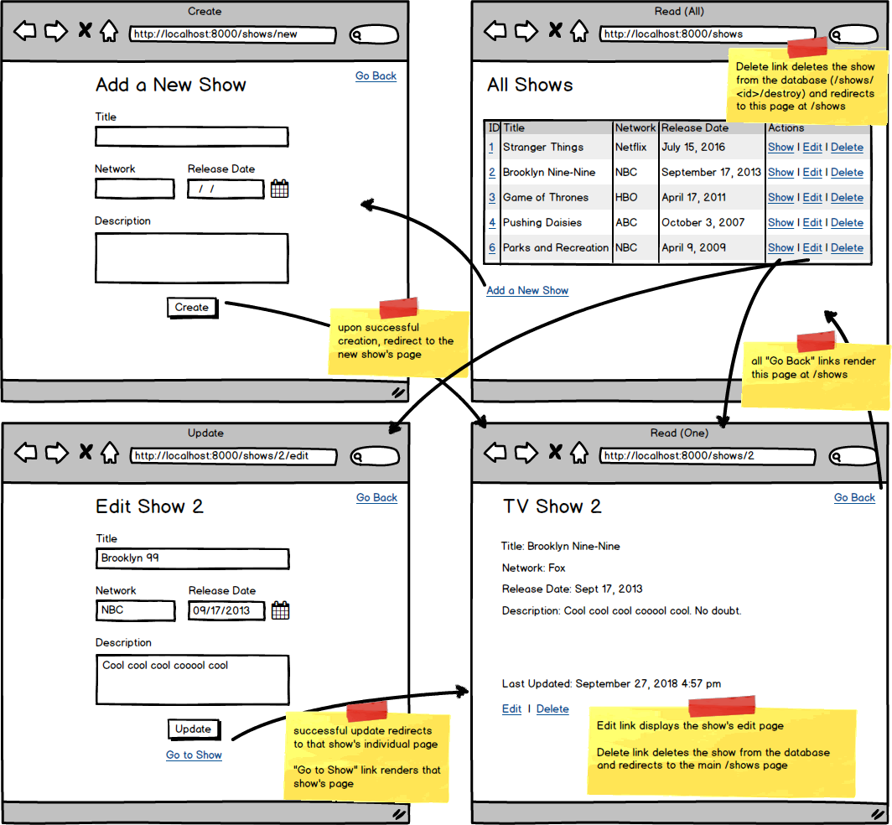

## Assignment: Semi-Restful TV Shows

### Objectives:

- Practice ORM queries from the controller
- Practice RESTful routing
- Practice rendering query results to templates
- Practice using form input to create table data

Now that we've got a basic understanding of the flow between models, views, and templates, let's make sure we know how to implement all 4 CRUD commands!

Remember that restful routing is simply a guideline of generally accepted routing naming conventions so other consumers of our routes can easily navigate our application and anticipate what the response will be for any given route. Since many web applications perform CRUD operations, you can imagine how confusing this could get if everyone followed different conventions for creating routing and method names for these operations.

Restful routing also gives us a chance to practice being methodical in our approach to building an application. For each step of CRUD, we start with the HTML, then build the routes to show that page. We can then build out the routes that will process any form submissions.

Ultimately, it's up to you (or maybe your boss) whether you also follow these rules/conventions, but we strongly encourage you to get familiar with the following rules for RESTful routing, as you may be making requests to, or someday creating your own, API.

Create a new Django project following the specifications provided in this wireframe:

- [x] Complete each of the following routes:
- [x] /shows/new- GET - method should return a template containing the form for adding a new TV show
- [x] /shows/create - POST - method should add the show to the database, then redirect to /shows/<id>
- [x] /shows/<id> - GET - method should return a template that displays the specific show's information
- [x] /shows - GET - method should return a template that displays all the shows in a table
- [x] /shows/<id>/edit - GET - method should return a template that displays a form for editing the TV show with the id specified in the url
- [x] /shows/<id>/update - POST - method should update the specific show in the database, then redirect to /shows/<id>
- [x] /shows/<id>/destroy - POST - method should delete the show with the specified id from the database, then redirect to /shows
- [x] Have your root route redirect to /shows

### Second Assignment VALIDATION

- [x] Validate the Add a TV Show form to ensure all fields are populated appropriately before adding to the database.
- [x] Display errors on the Add a TV Show form if the information is invalid.
- [x] Validate the Edit Show form with the same validations as creation.
- [x] Display errors on the Edit Show form if the information is invalid.
- [x] NINJA BONUS: Ensure the Release Date is in the past.
- [x] NINJA BONUS: Allow the description to be optional. If a description is provided, though, it should still be at least 10 characters.
- [ ] SENSEI BONUS: Validate that a TV show with that title does not already exist in the database before creating or updating.
- [ ] SENSEI BONUS: Do uniqueness validations (including displaying errors) for creating and updating using AJAX!

### My finished project:

