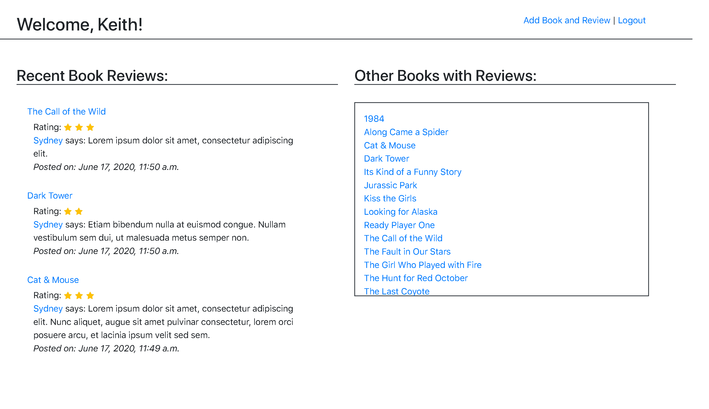
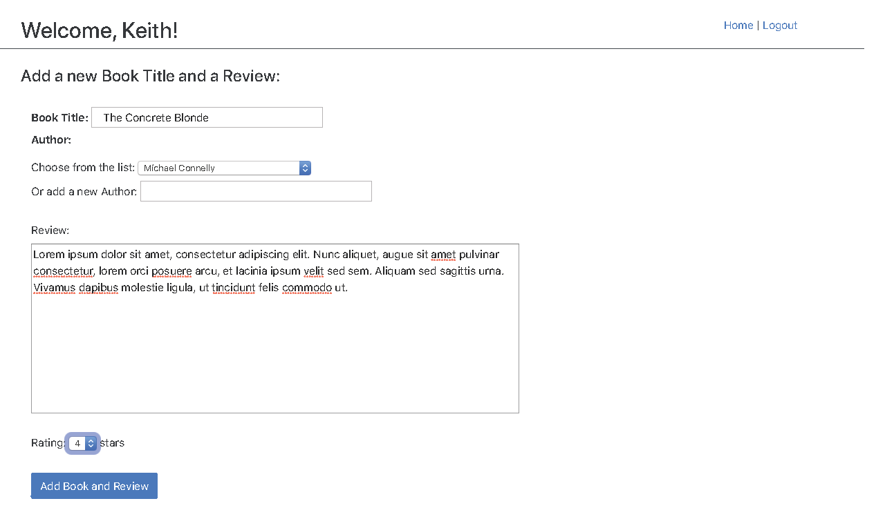
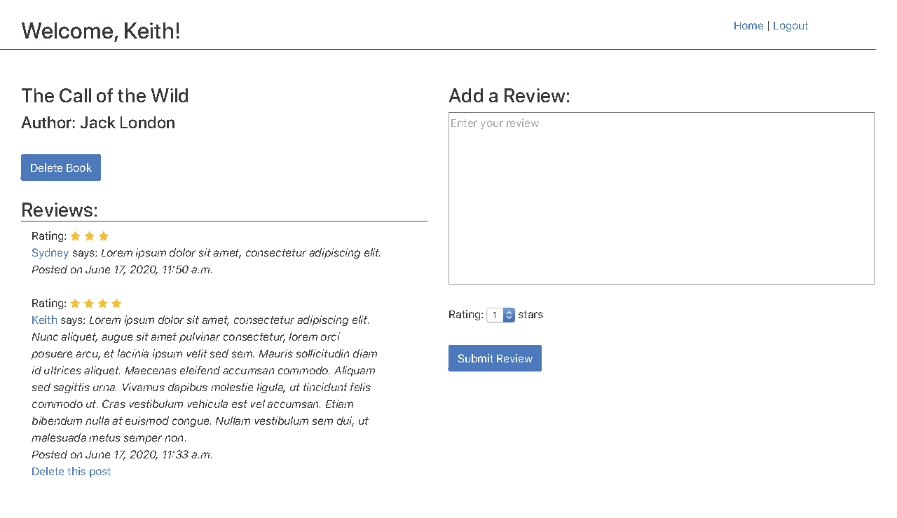
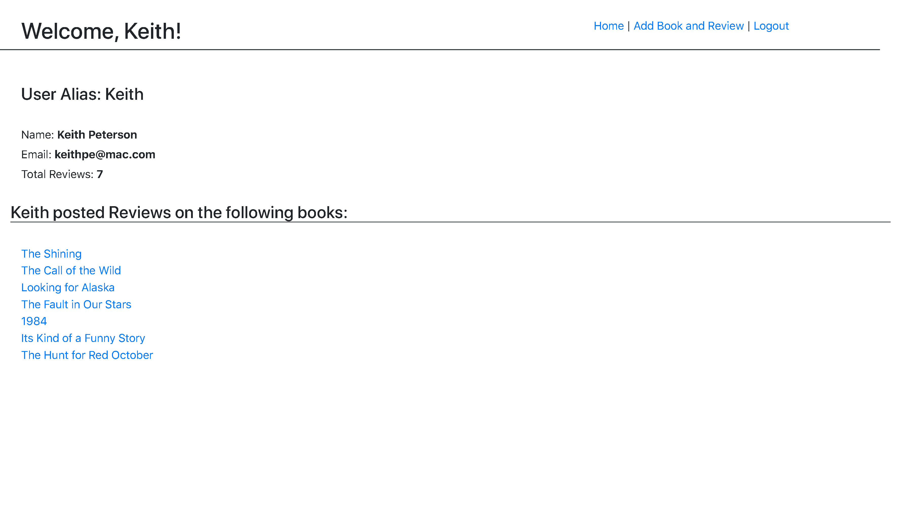

## Assignment: DojoReads (Belt Reviewer)

This assignment is optional and if you haven't already finished all the mandatory assignments, you should finish them first before working on this assignment. Most likely if you were able to build the wall and felt comfortable with the assignments, you'll do fine with the belt exam. If you do want additional preparation, please feel free to work on this assignment but be aware that as soon as you take your belt exam, you're expected to immediately start working on your project.

Using the below wireframe, create a Django application where logged in users can view and add book reviews. A user should also be able to delete his/her own reviews.

**Belt Exam Notes**

Your belt exam consists of two parts.

The first part will be a 10-minute short-answer portion to cover some key concepts of web development in Python. After the short-answer portion, you will proceed to the second part.

The second part consists of 4.5 hours with another 30 minutes for any interruptions that you may encounter (phone calls, bathroom breaks, etc). You’ll be given a wireframe of a web application and asked to both create it (from database to front-end) and deploy it.

The exam will be conducted during class if you’re part of the on-site bootcamp. Generally, you take the exam through learn.codingdojo.com/exams.

For the sample exam above, you can take as much time as you want. Here are helpful tips to help you earn your belt:

- Know that many of our black belt students had to take the belt exam two or even three times. These exams are NOT easy. We give these exams to those that apply to join Coding Dojo staff as an instructor/consultant, many of whom have 5-7+ years of experience, and 70-80% of them fail the exam. Do NOT get discouraged, and even if you fail the first time, take it again until you can earn your red/black belt. We believe that all of our students can get belts. It’s just a matter of time and perseverance.
- Make sure you revisit the SQL queries chapter. You’ll have to know how to do JOIN statements as well as how to do SELF joins. Make sure you feel comfortable with complex SQL queries before you take the exam.
- Make sure you understand how to pass parameters via URL (e.g. http://localhost/users/show/5).
- Make sure you really understand how to do login and registration. You will need that functionality for the exam.
- Note: if your location offers iOS, the iOS track is rigorous. If you are unable to pass a belt exam with a score of 9.5 or better prior to starting the iOS track, talk with your bootcamp leader to make sure that you can achieve the goals that you have for the iOS program.

After you complete the belt reviewer above, we strongly encourage that you talk to other members of your cohort to see how they’ve done the assignment. Seeing how others have done the sample exam will help you to appreciate different ways of doing things and will help you to become a better developer.

### My finished project:

#### Screen images of this project:

