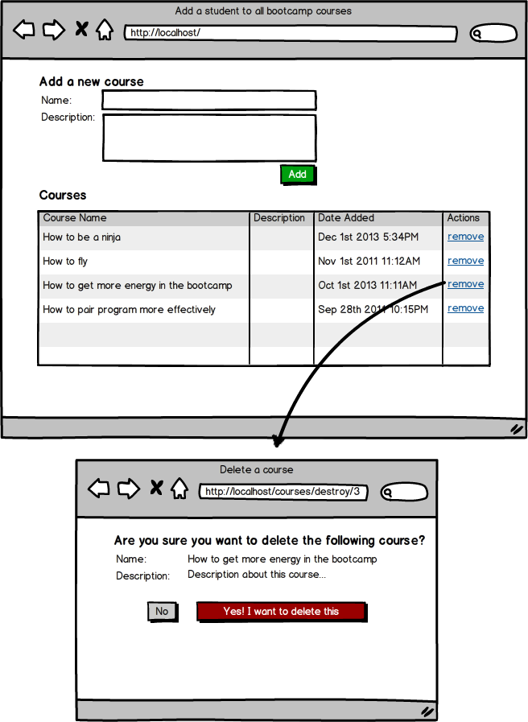
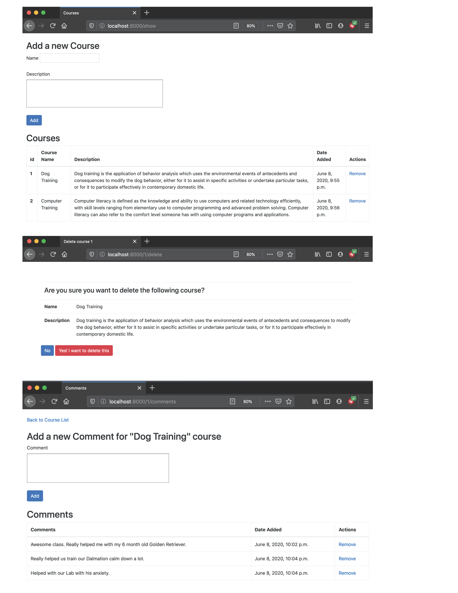

## Assignment: Courses

### Objectives:

- More practice with full-stack creating, reading, and deleting from a database
- More practice with model validations
- Learn how to implement one-to-one relationships with Django's ORM

Make a new Django project and application, and complete the functionality of the wireframe below. Require the course name to be more than 5 characters and the description to be more than 15 characters.

### Bonus Features (Optional)

- Make description a one-to-one relationship with the Course table rather than a column in the course table (intermediate).
- Add an action comment to each course that takes you to a page where you can add comments about that course and view all comments that have been entered (advanced)

- [x] Complete each of the following routes:

- [x] Make a new Django project and app
- [x] Have the root route render the main wireframe above
- [x] Create the POST method to add new courses to the database
- [x] Ensure that the name entered is more than 5 characters, and the description is more than 15 characters
- [x] Display all the courses in a table beneath the form
- [x] For each course, have a link to remove that renders a page as shown in the second wireframe
- [x] If the user selects "No," redirect to the root route. If the user selects "Yes," delete the course and redirect to the root route
- [x] NINJA BONUS: Make the description a separate class and have the description field of the Course class be a one-to-one relationship with Description
- [x] NINJA BONUS: For each course, have a link to comment that renders a page with a form to make comments and a list of all comments for that course
- [ ] SENSEI BONUS: Use AJAX for the remove functionality, prompting with a modal and processing the remove accordingly (No--close the modal without deleting, Yes--close the modal and delete the entry)

### My finished project:

