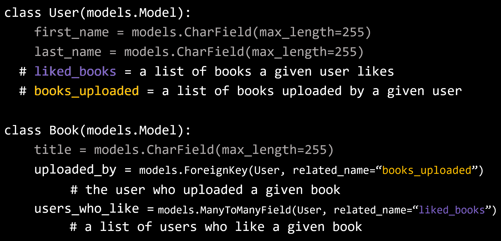
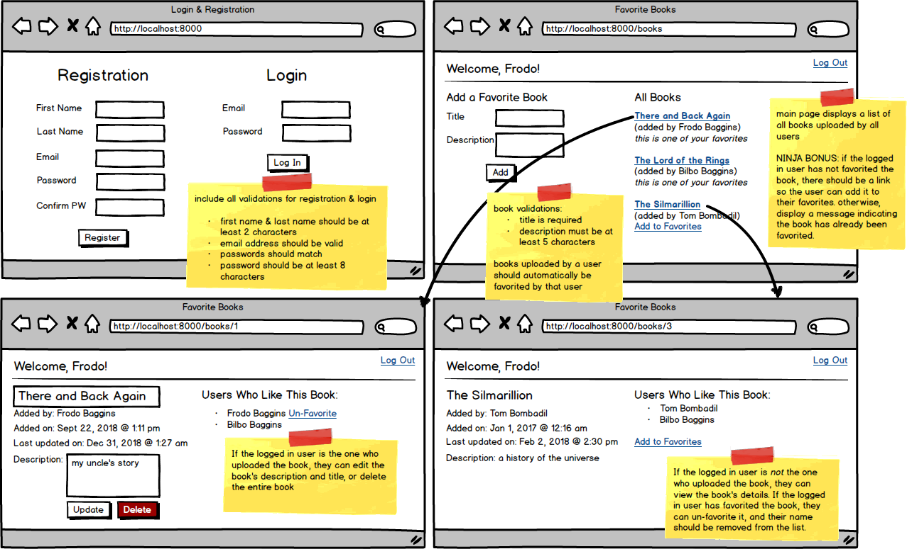
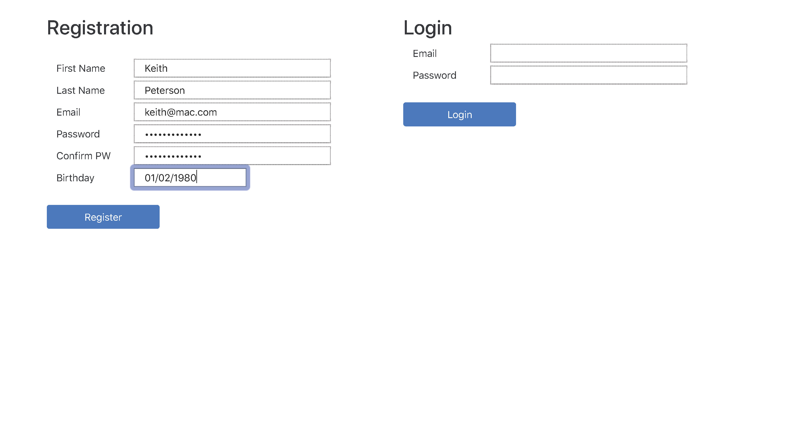
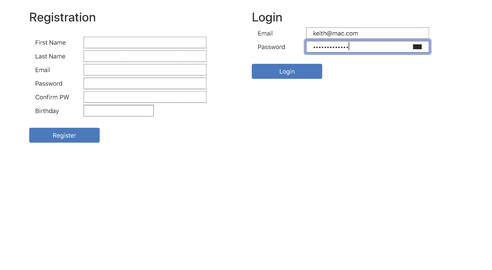
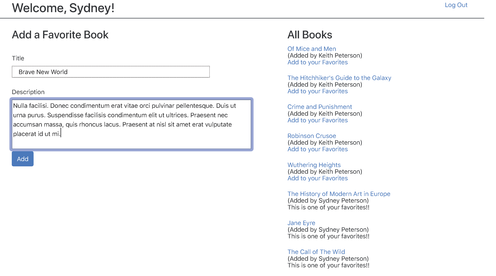
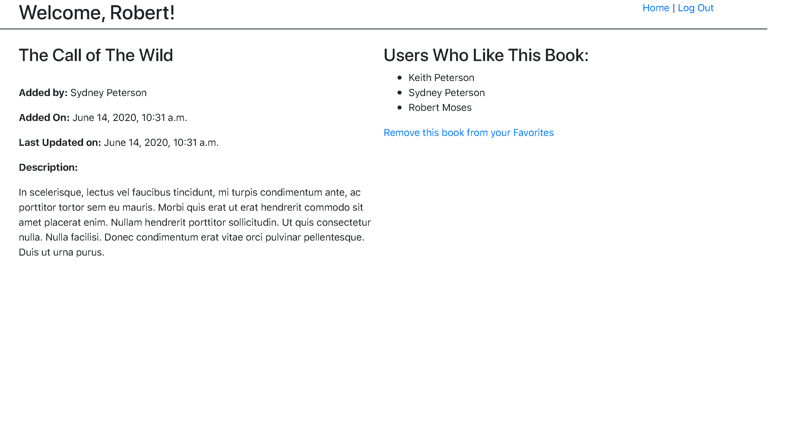
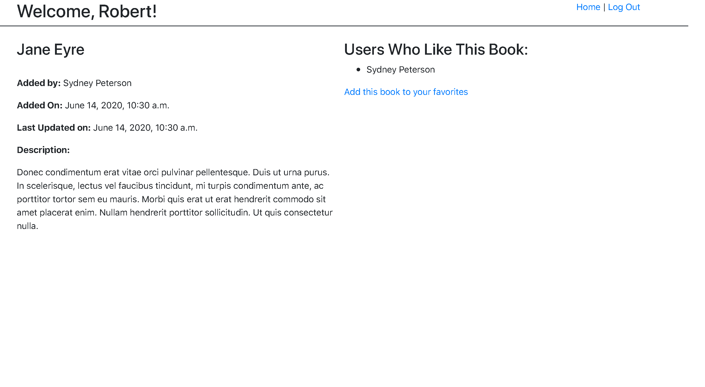
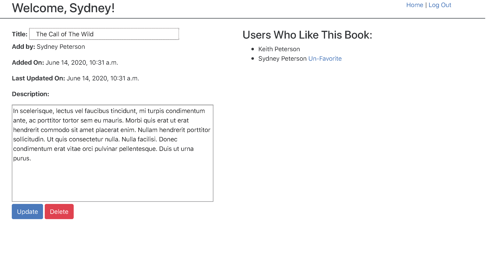

## Assignment: Favorite Books

### Objectives:

- Practice one-to-many and many-to-many relationships

Say we wanted to create a website where users can upload their favorite books and other users on the website can indicate whether that book is also one of their favorites. For the database diagram, we come up with the following, realizing that there can be more than one relationship between two tables:


Let's review the two distinct relationships between the users and books tables.

- One is a one-to-many relationship because a user can upload many books, and a book can be uploaded by one user. In our database, the uploaded_by_id field (in the books table) stores this relationship.
- The second relationship is a many-to-many relationship, where a given user can like many books, and a given book can be liked by many users. This relationship is stored in the third table. (In the diagram, this is the likes table.)

If we retrieve a book from the database and want the associated user(s), how do we distinguish between these two different relationships? We may want the user who uploaded the book, or the users who like this book. Wouldn't it be nice if each class had some attributes like this:

```python
class User(models.Model):
    first_name = models.CharField(max_length=255)
    last_name = models.CharField(max_length=255)
  # liked_books = a list of books a given user likes
  # books_uploaded = a list of books uploaded by a given user

class Book(models.Model):
    title = models.CharField(max_length=255)
  # uploaded_by = user who uploaded a given book
  # users_who_like = a list of users who like a given book
```

This is exactly what related_name provides!



According to this,

- To get the user who uploaded a book: Book.objects.first().uploaded_by
- To get the list of books uploaded by a user: User.objects.first().books_uploaded.all()
- To get the list of users who like a book: Book.objects.first().users_who_like.all()
- To get the list of books a user likes: User.objects.first().liked_books.all()

Create an application that performs the following:



- [x] Create a new Django project and bring in your login app (or recreate it) and create a new wall app

* [x] Create the User and Book models with all appropriate relationships
* [x] Incorporate a validated login/registration page
* [x] On the main page, allow the user to add a new book, with validations. Added books should automatically be favorited by the logged in user.
* [x] Have a list of all the books on the main page displaying the title and the user who uploaded the book
* [x] When the title is clicked, display a page with the book's information, including a list of all users who have favorited that book
* [x] If the logged in user has favorited the book, they should be able to "un-favorite" the book
* [x] If the logged in user has not yet favorited the book, there should be a link to add this book to their favorites
* [x] If the logged in user is the uploader of the book, allow them to edit (same validations apply) or delete the book
* [x] NINJA BONUS: On the main page, if the logged in user has not favorited the book, there should be a link so the user can add it to their favorites. Otherwise, display a message indicating the book has already been favorited.
* [ ] SENSEI BONUS: Add a user page that allows the user to view a list of all their favorite books

### My finished project:







