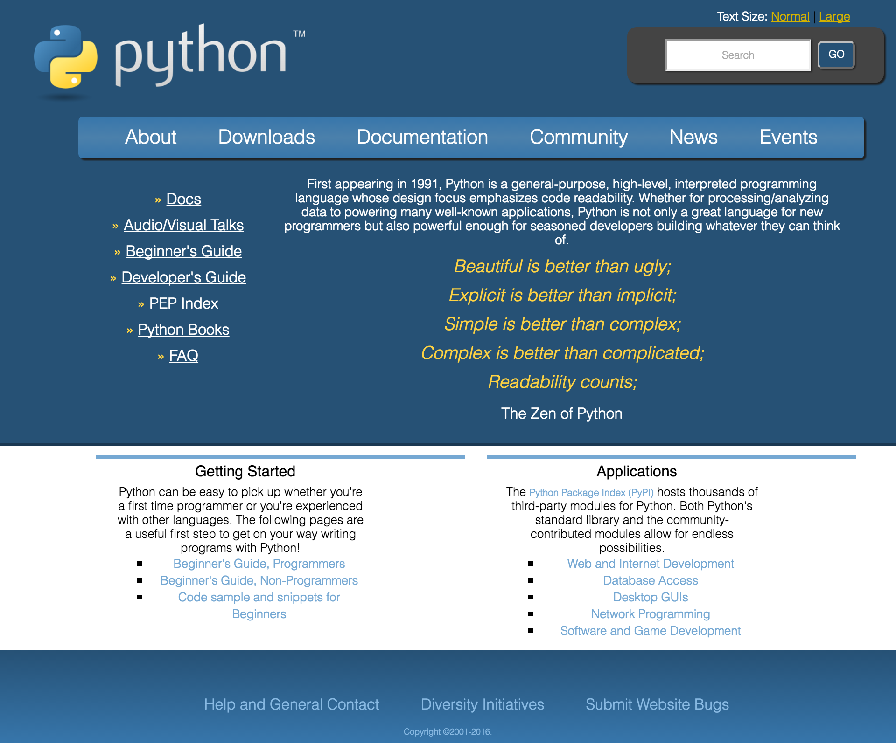
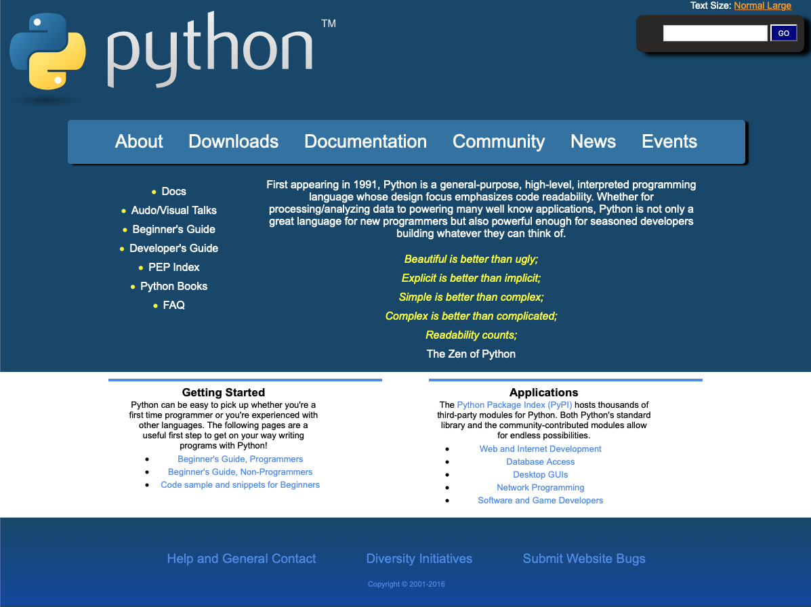

# web-fundamentals-css-about-python

# About Python

Break down the image below into proper HTML and CSS. Feel free to download the assignment here: Python

Use images here for this exercise.
Make sure you've validated your HTML and that you're not using any float: left or right.
For the ">>" on the list, don't worry about making it look exactly like >>. You can just use a normal circle for this assignment.
Do NOT make this responsive.  Just make this work for a fixed width (set the width to be 970px).  You will go through our responsive design course later. For now, try to master the CSS principles for fixed width first.

Validate HTML at:  https://validator.w3.org/

Don't use unnecessary division tags, classes or ids.

### The OFFICIAL "About Python" Web Site

### My Finished "About Python" Web Site

