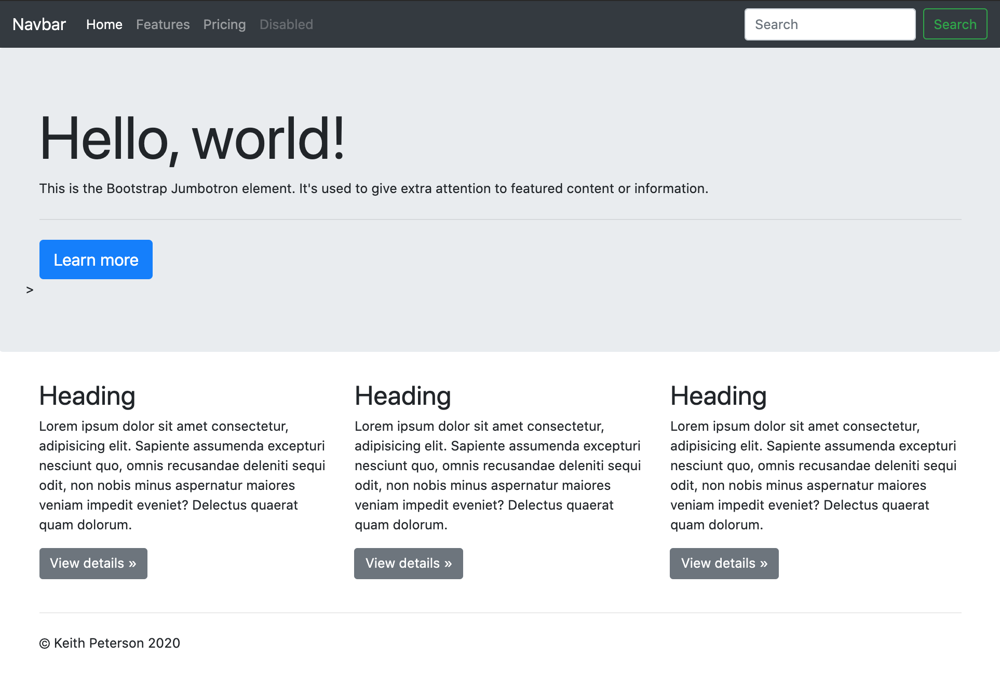

# web-fundamentals-css-bootstrap

# Bootstrap

## Assignment - what to learn first

After spending a few minutes checking all the examples on https://getbootstrap.com/docs/4.1/examples/, please create a simple website using the following elements of Bootstrap.  Please ignore all the other bootstrap elements other than what we want you to focus below:

Containers - https://getbootstrap.com/docs/4.0/layout/overview/ (just learn about "container" class and skip everything else)

Buttons - https://getbootstrap.com/docs/4.0/components/buttons/ 

btn  
btn-default  
btn-primary  
btn-success

Jumbotron - https://getbootstrap.com/docs/4.0/components/jumbotron/ 

Navbar - https://getbootstrap.com/docs/4.0/components/navbar/ 

Forms

form-group 
form-control

Grid system (for positioning and sizing of elements):

row  
col-md-4  
col-md-offset-2

As you haven't learned jQuery yet, please do not worry about any javascript portion of Bootstrap, which is basically anything that does something when you click on a specific HTML element (e.g. dropdown button, etc).  Just focus on how to make the html elements look good.

Do not spend more than 3 hours learning Bootstrap. There are many other features within Bootstrap, but you can learn them later, perhaps when you build your first project.

By the end of this assignment, make sure you feel comfortable with creating a site like https://getbootstrap.com/docs/4.1/examples/jumbotron/ (except the dropdown menu).

### My Finished "Bootstrap" Web Site
