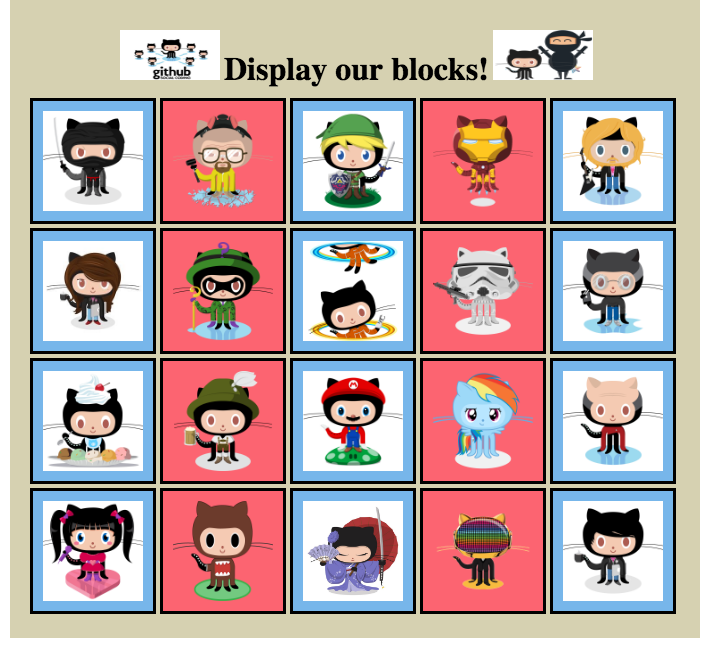
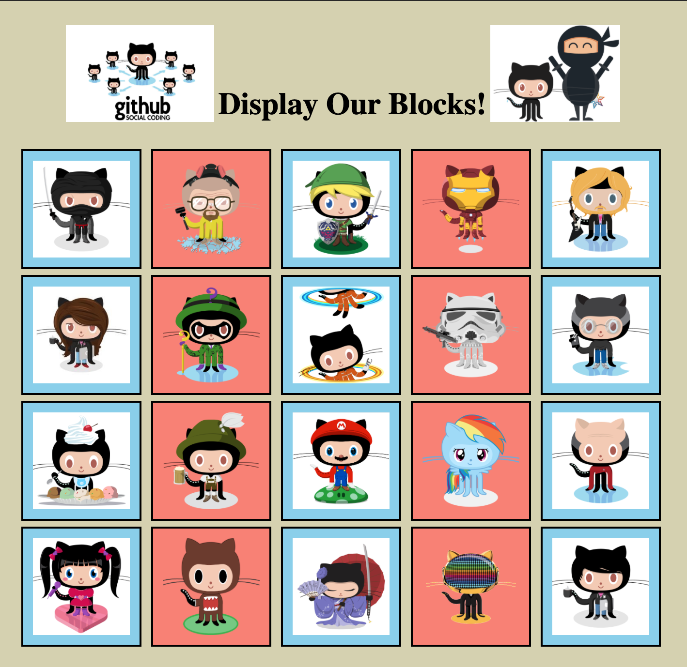

# web-fundamentals-css-displaying-blocks

# Displaying Blocks

Use margins and paddings to adjust the spaces between divisions and use the display property to be able to put each block in its proper place.

### The OFFICIAL "Displaying Blocks" Web Site

### My Finished "Displaying Blocks" Web Site
