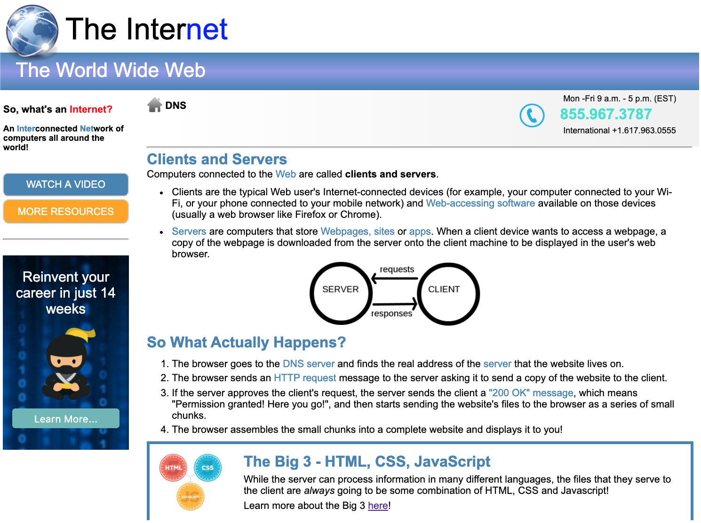

# web-fundamentals-css-internet

# The Internet

For this assignment, we want to watch how many times we're using 
 tags. Whenever you have one element within a division, it means you don't need that division! 

Duplicate the page below:

### The Official Internet Web Page

It's recommended that you reset and normalize the CSS attributes before you add your own CSS attributes.

Download the cropped images to be used for this exercise.
Make sure you've validated your HTML and that you're not using any float: left or right.

Make sure you double checked your code for any redundant use of ids or classes. Make sure you don't have any single element within a division. 

Refactor your HTML code, if necessary.

### My Finished Internet Web Page
