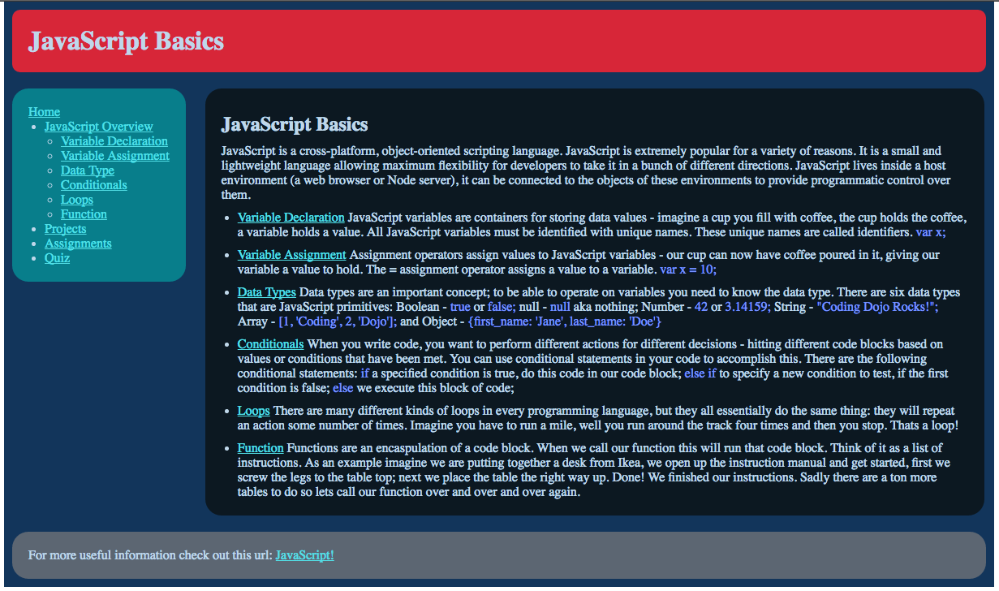
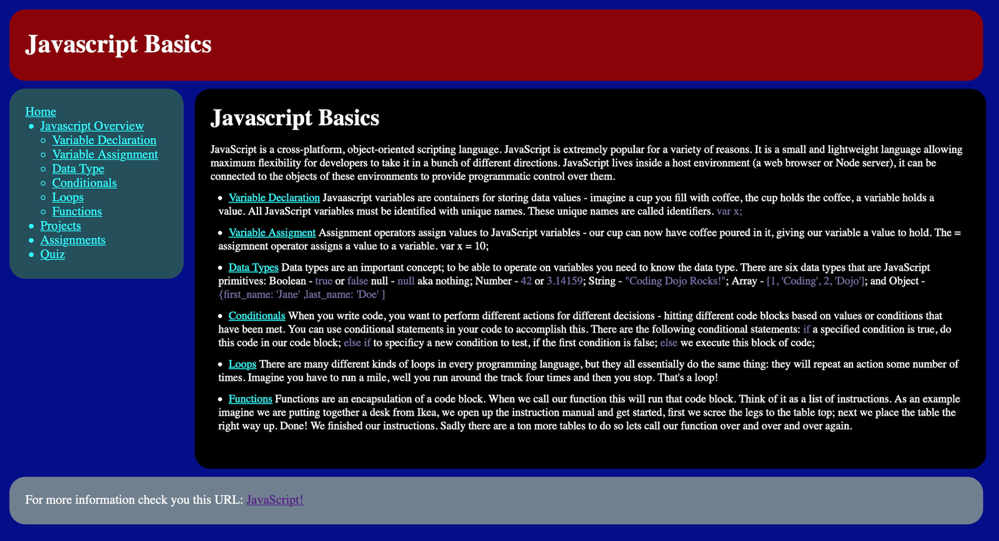

# web-fundamentals-css-javascript-basics

# Javascript Basics 

Recreate the image below using only what you've learned about HTML and CSS. Use display: inline-block/inline/block to do all of these assignments. You can download the image here: JavaScript Basics

Before you submit your work:

Remember that you're here to learn: Don't try to find the original source code of these images.
Make sure you've validated your HTML.
Also, do NOT make this responsive. Just make this work for a fixed width (set the width to be 970px).  If you have time during the bootcamp, go through our responsive design course later, but, for now, try to master the CSS principles for fixed width first.  The responsive design course is added at the end of the Web Fundamentals track, and you can do this later in your bootcamp.

Validate HTML at:  https://validator.w3.org/

Don't use unnecessary division tags, classes or ids.

### The OFFICIAL "Javascript Basics" Web Page

### My Finished "Javascript Basics" Web Page
