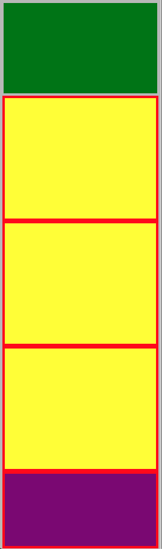

# web-fundamentals-css-plotting-your-blocks-responsive

# Plotting Your Blocks (responsive version)

### Author: Keith Peterson

Using your 'Plotting Your Blocks' assignment, convert it to responsive as shown below. Use 3 break points, 480px or smaller for phone screens, 481px or larger for tablet screens, and 1024px or larger for laptop/pc screens. Notice the blue box disappears in the medium and small screens.

### The Official "Plotting-your-blocks-responsive" Web Site

### My Finished "Plotting-your-blocks-responsive" Web Sites

