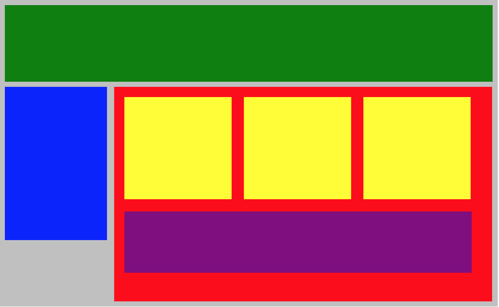

# web-fundamentals-css-plotting-your-blocks

# Plotting Your Blocks

### Author: Keith Peterson

Try to duplicate the image below by adjusting the CSS code provided. Use margins and paddings to adjust the spaces between divisions and use the display property to be able to put each block in its proper place. You may need additional CSS properties.

While you do this assignment, please use **min-height** as well as **vertical align** to give minimum height to the division and also to vertically align some of the inline-blocks.  Also, please **do NOT use float** (use display:inline-block instead).

### The Official "Plotting-your-blocks" Web Site


Here's the HTML code:
```javascript
<!DOCTYPE html>
<html lang="en">
   <head>
      <title>Position Practice</title>
      <link rel="stylesheet" type="text/css" href="style.css">
   </head>
   <body>
       <div id="wrapper">
         <div id="header"></div>
         <div id="navigation"></div>
         <div id="main_content">
            <div class="subcontents"></div>
            <div class="subcontents"></div>
            <div class="subcontents"></div>
            <div id="advertisement"></div>
         </div>
      </div><!-- end of wrapper -->
   </body>
</html>
```

And CSS:

```css
/*CSS reset settings here*/
*{
 margin: 0px;
 padding: 0px;
}
#wrapper{
 width: 950px;
 background-color: silver;
 margin: 0px auto;
}
#header{
 min-height: 150px;
 background-color: green;
}
#navigation{
 min-height: 300px;
 width: 200px;
 background-color: blue;
}
#main_content{
 min-height: 400px;
 width: 700px;
 background-color: red;
}
.subcontents{
 min-height: 200px;
 width: 210px;
 background-color: yellow;
}
#advertisement{
 min-height: 120px;
 width: 660px;
 background-color: purple;
}
```

### My Finished "Plotting-your-blocks" Web Site



