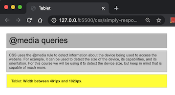

# web-fundamentals-css-simply-responsive

# Simply Responsive 

Create the website below using media queries. For this exercise, you don't need to change the title tag as the screen resizes.  

Validate HTML at:  https://validator.w3.org/

### The OFFICIAL Simply Responsive Web Site

### My Finished Simply Responsive Web Site

