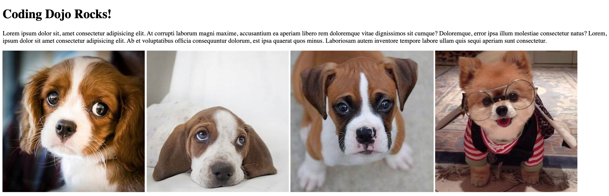

# git-branching-merging

# Branching and Merging

In this assignment, we will create and merge branches with Git! Start by creating a project and run git init to initialize your git repository. Create a simple HTML page like the image below. Don't use floats, use display: inline-block/inline/block instead.

Once completed, commit those changes to your master branch. Now we want you to practice branching - to make changes, commit changes, and merge your changes into the master branch. When your page looks like the image above, create a new branch and call it "add-css". Checkout the add-css branch and then add some CSS to the web page. It should look like the picture below.

When you're done, while you're still on your add-css branch, commit your changes. Next, checkout the master branch and merge your add-css branch into the master branch. Your master branch will now be updated with all the changes.

**Before you submit your work:**

- Make sure you've validated your HTML and that you're not using any float:left or right.

- Make sure you've refactored your code. Don't use unnecessary division tags, classes or ids.

- [x] Create a new folder and call it 'branching_merging'
- [x] Build out the html and commit changes
- [x] Create a new branch - call it 'add-css'
- [x] Checkout to your 'add-css' branch, add CSS style, and commit changes
- [x] Merge the add-css branch back into the master branch
