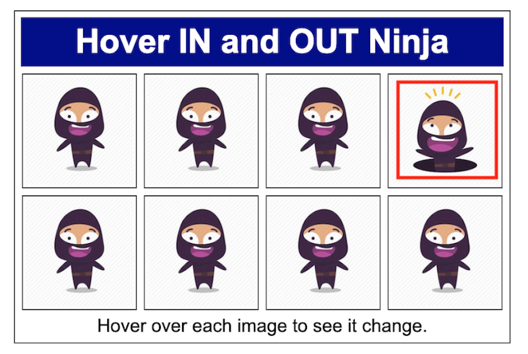
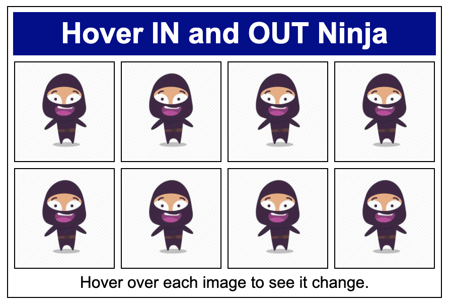

# web-fundamentals-jquery-Hover-In-Out

# Assignment: Hover In/Out

Create a simple HTML page with 4 images of equal width and height (you can use any image you like). When the mouse hovers on an image, have that be replaced by another image (on the same position). When the mouse hovers out of the image, bring the original image back.

**HINT: The jQuery .hover() function accepts 2 functions as parameters: the first function runs the code for when we enter the area with the mouse, the second writes the code for what we want to happen when the mouse leaves the area!**

### Hover on:

### Hover off:

