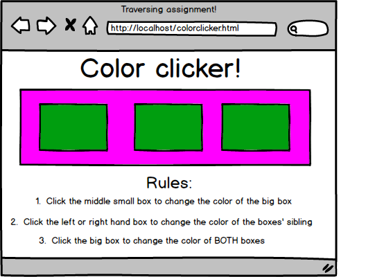

# web-fundamentals-jquery-color-clicker

# Color Clicker

For this assignment, you should use the traversing methods discussed in this chapter. Instead of creating this project from scratch, copy the code at the bottom of this page and use it as a starting point. You will notice that there is a function we use in the code called event.stopPropagation() in the .click() method for the child elements of the large box. This function prevents the .click() method from propagating from the child element to the parent element because, technically, when you click the smaller boxes, you are also clicking the big box too. This function allows us to make the .click() event exclusively for the small boxes and not the big boxes. To see this in action, comment out the event.stopPropagation() functions and see what happens when you click a small box. Good luck!

**Hint: The function called random_color() that is defined in the template will return a random hexadecimal value that can be used as a background coloring. Simply call that function and a value will be assigned!**



```html
<html>
  <head>
    <title>The Codingdojo ColorClicker!</title>
    <script
      type="text/javascript"
      src="http://code.jquery.com/jquery-1.10.2.min.js"
    ></script>
    <script type="text/javascript">
      function random_color() {
        var rgb = [
          "a",
          "b",
          "c",
          "d",
          "e",
          "f",
          "0",
          "1",
          "2",
          "3",
          "4",
          "5",
          "6",
          "7",
          "8",
          "9",
        ];
        color = "#"; //this is what we'll return!
        for (var i = 0; i < 6; i++) {
          x = Math.floor(Math.random() * 16);
          color += rgb[x];
        }
        return color;
      }
      $(document).ready(function () {
        $("#large_box").click(function () {
          alert("you clicked the big box!");
          //comment this out when you have figured out what event.stopPropagation is used for
        });
        $(".side_box").click(function (event) {
          event.stopPropagation();
        });
        $(".middle_box").click(function (event) {
          event.stopPropagation();
        });
      });
    </script>
    <style type="text/css">
      * {
        font-family: sans-serif;
      }
      h2,
      h1,
      h3 {
        text-align: center;
      }
      #large_box {
        margin: 0px auto;
        margin-top: 30px;
        background-color: lightblue;
        width: 1200px;
        height: 300px;
      }
      #large_box div {
        background-color: blue;
        display: inline-block;
        width: 350px;
        height: 130px;
        margin: 60px 20px;
      }
    </style>
  </head>
  <body>
    <h1>The Codingdojo ColorClicker!</h1>
    <div id="large_box">
      <div class="side_box"></div>
      <div class="middle_box"></div>
      <div class="side_box"></div>
    </div>
    <h2>Rules</h2>
    <h3>
      1. Clicking the big box should change background colors of both the small
      and large boxes!
    </h3>
    <h3>
      2. Clicking the middle small box should change the color of the big box!
    </h3>
    <h3>
      3. Clicking the left or right small box should change the color of that
      box's siblings
    </h3>
  </body>
</html>
```
