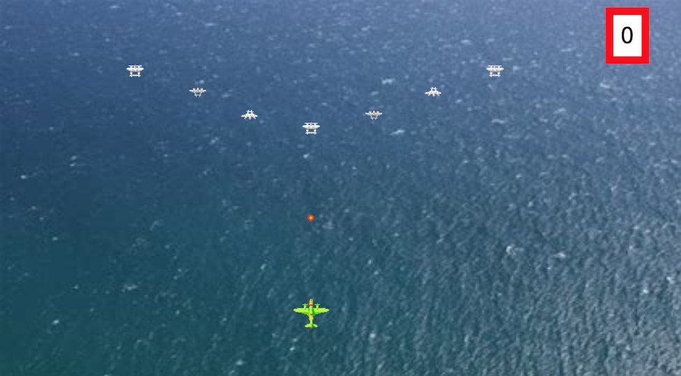

### 1942

**Challenges**

- [x] (easy) Get the hero to move up/down/left/right
- [x] (easy) Change the background of the game
- [x] (easy) Get 7 enemies to show up instead of 4 at a time
- [x] (intermediate) Get another type of enemy airplane to show up
- [x] (advanced) Collision Detection for the airplanes – when the hero collides with the enemy, have your score go down by 500.
- [x] (advanced) Collision Detection for the bullet – Have the score go up by 10 when an enemy is struck down.
- [ ] (advanced) Get the enemy to explode when it is hit
- [x] (advanced) When the bullet hits, make a sound.

**Sound effects from here**
https://www.freesoundeffects.com/free-sounds/bomb-10076/

### Video Demo of game running:

