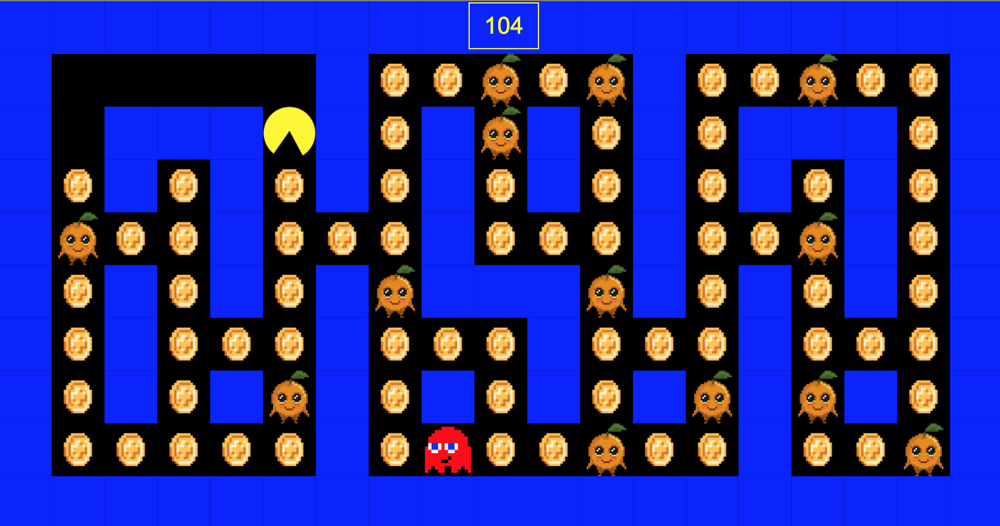

# web-fundamentals-js-pacman

# Objectives

* See how Javascript can be integrated with HTML and CSS and add interactions

* Help you visualize and integrate algorithms to create things

* Get more comfortable with multi-dimensional arrays and for loops

* See how algorithms can be fun.

# Goals

The goal of this assignment/video is 1) for you to see Michael Choi's workflow and learn from how Michael builds things and 2) for you to start applying some of the algorithms you've learned to start creating simple apps.  If you're rusty on implementing the algorithms to build the necessary features, please 1) redo the algorithm app and make sure you understand all the key points in the app as well as the mandatory 13 challenges and 2) reach out to other colleagues in your group and see if they can work with you.  Don't feel bad if you don't have time to work on these assignments, but if you do have the extra time, please watch the video and work on this assignment for at least 4 hours.

### My Finished "Pacman" Web Site

# Additional Challenges:

- [x] Prevent PacMan from leaving the maze or going through the walls.
- [x] Change the world map and make the maze more interesting!
- [x] Get cherries to appear. Cherry = 50 pts.
- [x] Get PacMan to lookup up/down/left/right depending on the direction PacMan is moving.
- [x] (Optional) Get a ghost to show up (the ghost does not have to move yet). When PacMan meets the ghost, have PacMan lose its life.
- [ ] (Optional) Get the ghost to move around in random directions.
- [ ] (Optional) Get two PacMans to show up and move! (use one keyboard to move 2 PacMans)